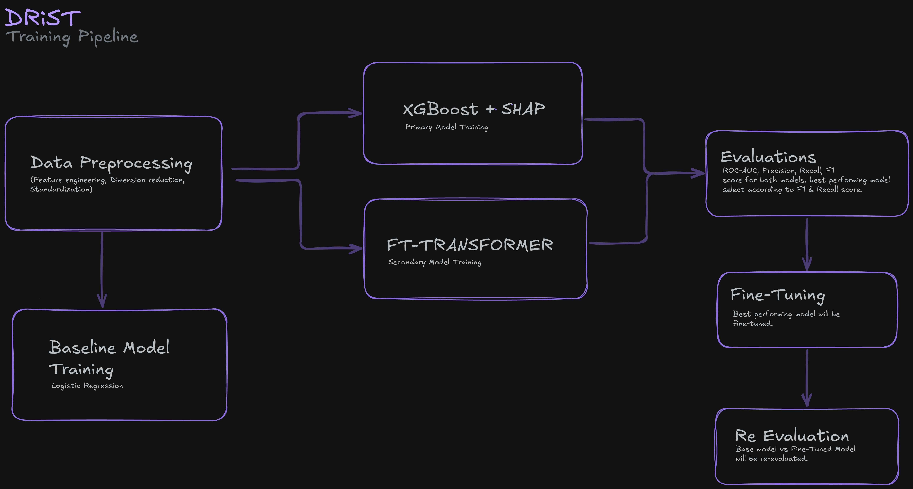

         ____   ____    _   ____   _____
        |  _ \\ |  _ \\  (_) / ___| |_   _|
        | | | || |_) | | | \\___ \\   | |
        | |_| ||  _ <  | |  ___) |  | |
        |____/ |_| \\_\\ |_| |____/   |_|
        Diabetes Risk Prediction Tool


<br>

## Project overview
DRiST is a diabetes risk screening tool built on the idea that early warning shouldn't require a scheduled checkup. Using common, self-reportable health indicators - blood pressure, BMI, activity levels, general health - it predicts whether someone is likely diabetic and estimates their probability of risk. It's tuned to flag generously rather than miss someone who's actually at risk: a screening aid meant to prompt a conversation with a doctor, not replace one. 

<br>

## Repo structure 

```
|- cli - contains the command line version of the application
|
|- data
|   |- raw - raw dataset 
|
|- notebooks - data preprocessing pipeline
|
|- results
|   |- eda visualizations - plots generated from data preprocessing pipeline
|   |- outputs - preprocessed dataset
|
|- scripts - scripts needed to install in order to get STT/TTS functionality
|
|- weights - trained models by group members
|
|- plots - model evaluation plots


```

## Project Pipeline


----
<br>

## How to run 


### Run Locally

Clone the project repo first. then run,
```sh
cd IT2011-AIML-Project

```
Then activate the virtual environment using:

```sh
python3 -m venv .venv
source .venv/bin/activate

```

Then run

```sh
python -m pip install -r requirements.txt

```

Run the Textual app by using:

```sh
python app.py
```
<br>

> Note: If you're uisng MacOS, make sure to install the OpenMP runtime once if you plan to use XGBoost:
```sh
brew install libomp
```

<br>

### Host in a browser

```sh
python serve.py --port 8080
```
Open localhost:8080 from your browser, and keep terminal running.

<br>

### Run the fully CLI version

```sh
python cli/app.py
```


<br>

### Install offline voice input

To enable STT/TTS features, run these commands in order *from the project root*. The voice setup script installs the optional audio/speech packages and the local model; `requirements-voice.txt` also includes `requirements.txt`.

```sh
python3 -m venv .venv
source .venv/bin/activate
python -m pip install -r requirements-voice.txt
bash scripts/setup-voice.sh
```
<br>

### How to use the voice feature with cli

The setup script installs the optional microphone package , text-to-speech package, installs whisper.cpp with Homebrew on macOS if needed, and downloads the Whisper `base.en` model. Once setup completes, start the CLI with `python cli/app.py`.

```
Text commands related to voice feature:
`voice` - for a single voice entry
`auto` - to enable continuous hands-free voice mode

Voice commands related to voice feature:
`manual` & `stop` - return to typing (use this before prediction)
```

To change voice, change microphone, and other features, see [Additional information]

<br>

## Assigned Dataset


| Property | Value |
|---|---|
| Source | CDC BRFSS 2015, Diabetes Health Indicators Dataset (Kaggle) |
| Records | 253,680, split 80% train / 20% test (stratified, `random_state=42`) |
| Features | 21 health and lifestyle indicators (binary flags plus ordinal and numeric columns such as BMI, GenHlth and Age) |
| Target | `Diabetes_binary` (0 = no diabetes, 1 = diabetes or pre-diabetes) |
| Class balance | About 86% no diabetes / 14% diabetes (test set: 13.9% positive) |
| Missing values | None |

**Preprocessing:** one-hot encoding, standard scaling of the numeric and ordinal columns, and six weak features dropped after chi-square, mutual-information and correlation checks (21 to 15 features). The training set is balanced by random undersampling (28,277 rows per class, 56,554 in total). 

<br>

## Model selection (justification w charts)

Six models were trained on the same preporcessed dataset


| Model | Why it is included |
|---|---|
| Logistic Regression | Linear baseline, easy to explain |
| KNN | Distance-based, no assumptions about the data |
| Decision Tree | Interpretable rules |
| Random Forest | Many trees voting, handles non-linear effects |
| XGBoost | Boosted trees, a strong classical baseline for tabular data |
| FT-Transformer | Each feature becomes an embedding token and self-attention learns how features interact; implemented directly in PyTorch (after Gorishniy et al., 2021) |

Because the tool is meant for screening, **recall** (the share of real diabetes cases found) was the main criterion, then F1 and ROC-AUC. The **FT-Transformer** was chosen as the final model: it has the highest recall of the six models (0.803, comparable across test sets) and the highest F1 (0.761) among the models scored on balanced sets, with ROC-AUC tied with XGBoost. **XGBoost** remains the lighter, faster and more interpretable alternative. The differences between the top models are small (under 0.01 on most metrics), so the choice is a preference for catching more cases, not a decisive win

<br>

## Evaluation 
### Test results

| Model | Test set | Accuracy | Precision | Recall | F1 | ROC-AUC |
|---|---|---|---|---|---|---|
| Logistic Regression | Real | 0.731 | 0.310 | 0.761 | 0.441 | 0.817 |
| Random Forest | Real | 0.716 | 0.301 | 0.784 | 0.435 | 0.818 |
| KNN | Balanced | 0.745 | 0.722 | 0.798 | 0.758 | 0.819 |
| Decision Tree | Balanced | 0.731 | 0.716 | 0.765 | 0.740 | 0.805 |
| XGBoost | Balanced | 0.749 | 0.738 | 0.770 | 0.754 | 0.823 |
| FT-Transformer | Balanced | 0.748 | 0.724 | 0.803 | 0.761 | 0.823 |

Precision, recall and F1 are for the diabetes class.


## Ablation
Trained without preprocessing or balancing, the same model reaches 0.866 accuracy but only about 0.15 recall (ROC-AUC 0.828). Accuracy there mostly reflects the 86% non-diabetic majority, which is why the training set is balanced.

(abl tbl comparison)
## Plots (performance matrices & eval)


<br>

## Team members & roles

| Student ID| Name | Contribution |
|---|---|---|
| ITxxxx | Ihsan Salman | contribution |
| ITxxxx | Chandira Anupama | contribution |
| ITxxx | Thirshe Perera | Feature selection using chi square, FT-transformer training, TUI, CLI application & voice agent |
ITxxx | Kasundi Pathirana | contribution |
ITxxxx | Gayashi Perera | contribution |
ITxxxx | Mithsuka Nugaliyadda | contribution |

<br>

## Additional information

Additional information related to voice feature:

- To use another microphone, list devices with `python -c "import sounddevice as sd; print(sd.query_devices())"`, then set its device index or name before launching:

```sh
export DRIST_AUDIO_DEVICE=2
python cli/app.py
```

- To use another whisper.cpp model, set `DRIST_WHISPER_MODEL` to its local model file; to use a differently named executable, set `DRIST_WHISPER_CLI`. Without the optional executable or model, normal typed input continues to work.

- To change the voice (Text To Speech)

List all voices available on your system:

```sh
python cli/app.py --list-voices
```
Pick a voice by setting its name (or any substring of it) before launching:

```sh
export DRIST_TTS_VOICE=Daniel     # British male
export DRIST_TTS_VOICE=Samantha   # US female (default macOS voice)
export DRIST_TTS_VOICE=Rishi      # Indian English male
export DRIST_TTS_VOICE=Zarvox     # robotic novelty voice
python cli/app.py
```

> **Note!**
Matching is case-insensitive and substring-based, so `daniel` and `Dan` both select **Daniel**. Other TTS controls:

| Variable | Default | Effect |
|---|---|---|
| `DRIST_TTS` | `1` | Set to `0` / `false` / `off` to disable TTS entirely |
| `DRIST_TTS_VOICE` | _(system default)_ | Voice name or substring, e.g. `Samantha`, `Zarvox` |
| `DRIST_TTS_RATE` | `175` | Speaking speed in words per minute |

Example — slow Zarvox robot voice:

```sh
DRIST_TTS_VOICE=Zarvox DRIST_TTS_RATE=130 python cli/app.py
```

<br>

Used packages for this project:

sounddevice, pyttsx3, whisper.cpp, base.en

<br>

## Limitations

- BRFSS 2015 is a US, self-reported, telephone survey, so it may not match the Sri Lankan population or current health patterns.
- Models were not all evaluated on the same real-distribution test set. Doing that, with a tuned decision threshold, is the next step.
- Undersampling discards majority-class records and may remove useful information.
- No subgroup (age, income, education) or external validation has been done.
- Coefficients and feature importances show associations, not causes.

<br>

## References

- Gorishniy, Y., Rubachev, I., Khrulkov, V. and Babenko, A. (2021). Revisiting Deep Learning Models for Tabular Data. NeurIPS 34.
- Chen, T. and Guestrin, C. (2016). XGBoost: A Scalable Tree Boosting System. KDD.
- Pedregosa, F. et al. (2011). Scikit-learn: Machine Learning in Python. JMLR 12.


